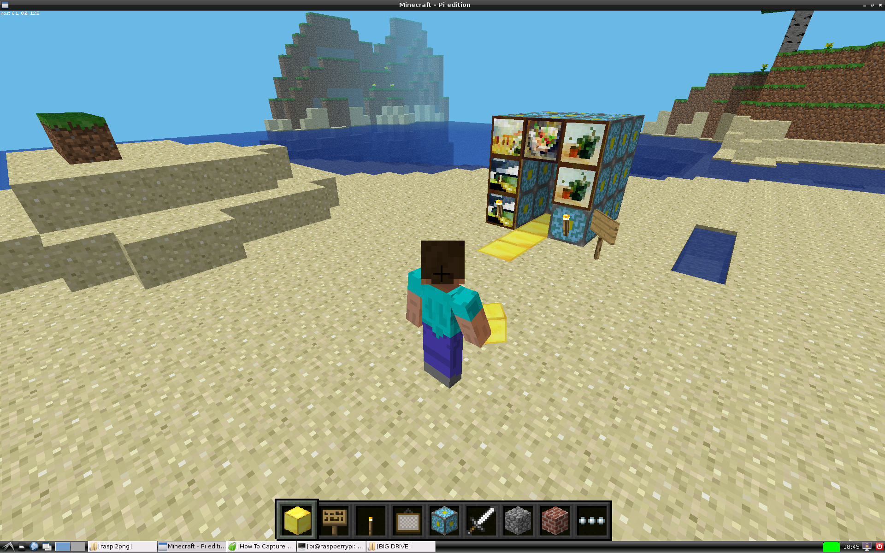

## Building a photobooth

Now you need to create a photobooth in the Minecraft environment. This is done manually and the photobooth can be built whereever you want to locate it.

Using any block type, build your photobooth. It can be any shape you like, but it should have at least one block width of free space inside so that the player can enter, like a door or gate.

Once you have created your photobooth, you need to be able to move your player inside and onto the trigger block. This is the block that the player stands on to run the function that you wrote in step 1, which will trigger the camera. In the Minecraft environment, your position is given in reference to the `x`, `y`, and `z` axis. Look at the top left of the window and you will see the `x`, `y`, `z` co-ordinates of your player, for example `10.5`, `9.0`, `-44.3`. Assuming you are still in the photobooth then these are also the `x`, `y`, `z` co-ordinates of the 'trigger' block in your photobooth.

- Walk into your photobooth

- Record the `x`, `y`, `z`, co-ordinates of your camera 'trigger' block.

[[[rpi-python-minecraft-steves-position]]]